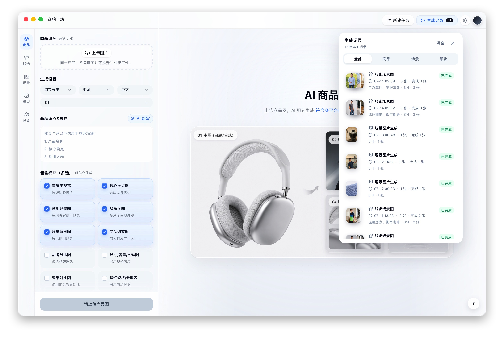
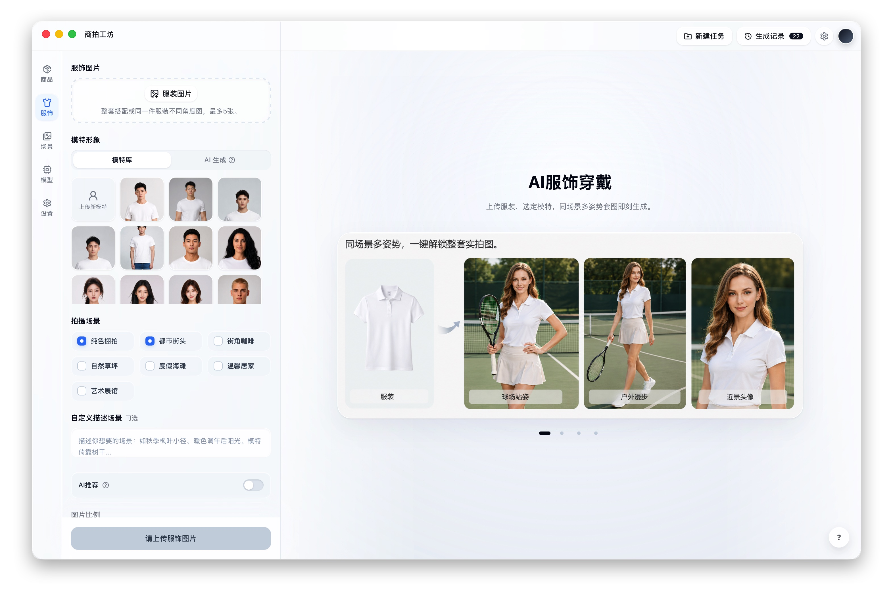
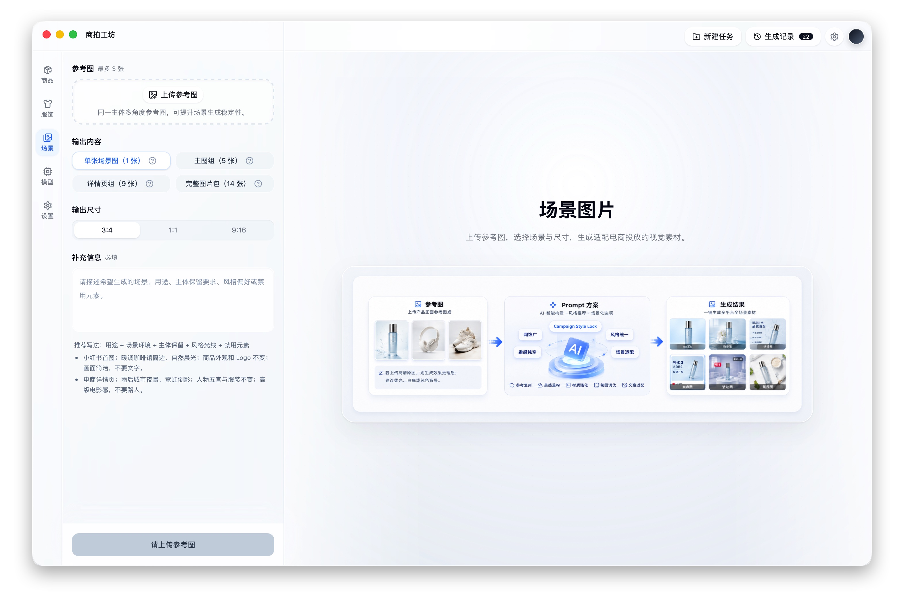
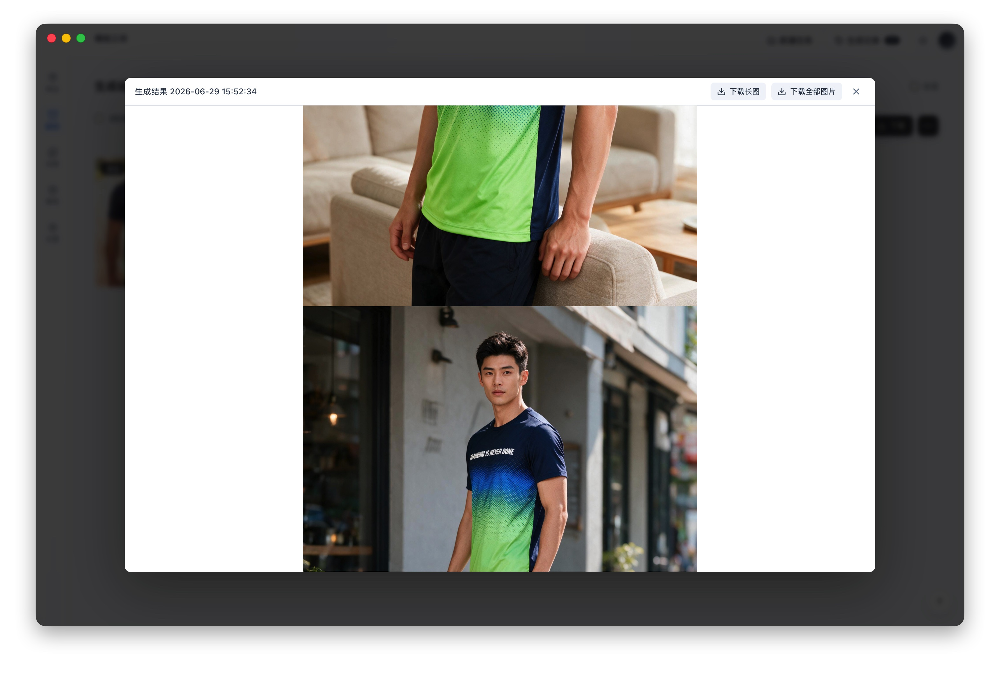

<div align="center">

# 商拍工坊

### 把商品图、模特图和营销场景图，放进同一个工作台

商拍工坊是一款面向电商商家、运营与视觉团队的本地优先 AI 商拍桌面应用。<br>
从参考素材、视觉方案到图片生成、二次调整和下载交付，让零散的 AI 出图变成一套可检查、可继续、可追溯的创作流程。

**商品详情 · 服饰试穿 · 营销场景 · 结果编辑 · 本地记录**

[核心能力](#一套工作台覆盖三类商拍任务) · [使用流程](#从参考图到可交付素材) · [开始体验](#开始体验商拍工坊)

</div>



## 少切工具，把时间留给更重要的判断

传统电商视觉生产往往散落在素材文件夹、提示词文档、模型平台和修图工具之间。方向变了，要重新沟通；某张图不合适，常常只能整组重来；任务一多，连哪张图来自哪次生成都很难说清。

商拍工坊把这些环节收进一套桌面工作流：

- **参考素材集中管理**：商品、服装、人物与场景参考图各归其位。
- **先看方案，再正式生成**：先确认图片用途、内容方向和场景规划，减少无效尝试。
- **成套内容统一生产**：围绕同一商品与营销目标组织多张素材，而不是只生成一张孤立图片。
- **生成之后继续处理**：重生成、改图、改字、调整尺寸、删除与下载都在结果区完成。
- **每次任务都有记录**：按商品、服饰和场景回看历史，继续处理失败或未完成的图片。

## 一套工作台，覆盖三类商拍任务

### 商品｜从卖点到详情视觉

上传商品参考图，补充核心卖点，再按平台、市场、语言和版式组织内容。你可以从 14 类详情模块中选择需要的画面，先审核生成策略，再制作首屏主视觉、卖点图、使用场景、细节展示、规格信息与上架文案。

- 支持淘宝天猫、京东、拼多多、抖音电商、亚马逊等常见平台方向。
- 支持中文、英文、日文、韩文、西班牙文等内容语言。
- 支持常用电商比例与 Amazon A+ 版式。
- 可选 AI 卖点提取、热门风格分析与商品上架文案。

### 服饰｜从模特设定到场景成片

选择服装与模特参考，设置人物特征、拍摄场景、画幅和角度。AI 会先规划场景与动作，再进入试穿图片生成，让服饰素材探索更接近一次完整拍摄，而不是一条不可控的提示词。

- 支持上传人物参考，也可先生成基准模特。
- 支持多张服装素材与多种预设场景。
- 支持先确认场景、动作和构图，再生成服饰展示图。
- 单张结果不理想时可独立重试，不必整组推倒重来。



### 场景｜从一张主图到完整图片包

上传参考图并说明营销目标，商拍工坊会从 25 类场景策略中自动选择合适方向，先给出可审核的场景方案，再生成单图、主图组、详情页组或完整图片包。

- 最多使用 3 张参考图补充主体、风格与场景事实。
- 支持单张场景图、5 张主图组、9 张详情页组和 14 张完整图片包。
- 支持 `1:1`、`3:4`、`9:16` 等常用画幅。
- 通过同一任务的风格约束，提升多张图片之间的视觉连贯性。



## 从参考图到可交付素材

1. **导入参考素材**：上传商品图、服装图、人物图或场景参考图，为生成结果提供真实视觉依据。

2. **说明营销目标**：补充商品卖点、目标平台、使用场景、画面比例、风格偏好与需要避免的内容。

3. **检查生成方案**：在正式出图前确认图片用途、场景规划、内容方向和生成数量。

4. **生成并继续调整**：在同一画布查看结果，按需改图、改字、调整尺寸、单图重试或删除。

5. **下载交付或稍后继续**：支持单图、批量压缩包和长图下载；本地生成记录方便重新打开并继续处理。

## 生成不是终点

结果区把常用的后续动作留在原任务上下文中：

- 对单张图片重新生成，保留其它满意结果。
- 以当前图片为基础进行 AI 改图或尺寸调整。
- 识别图片文字，只提交真正需要修改或删除的内容。
- 选择单张、部分或全部图片下载，也可预览并导出长图。
- 删除失败或不需要的结果，并在本地历史中继续追踪任务状态。



## 本地优先，边界更清楚

商拍工坊以本地工作区为核心管理素材、设置、任务、结果文件和生成历史。你可以按任务类型配置受支持的 AI 模型，在应用内测试连接并管理能力状态。

本地优先不等于完全离线：执行真实 AI 生成时，必要的参考图和业务输入会发送到你配置的模型服务。模型费用、配额、速度与生成效果取决于所使用的 Provider、模型和网络环境。

## 为谁而做

- **电商商家**：需要持续准备商品主图、详情页图和活动素材。
- **电商运营**：希望把卖点、场景和视觉内容组织成连贯的上架物料。
- **服饰团队**：需要围绕模特、服装、动作和场景快速探索试穿效果。
- **视觉设计团队**：希望用 AI 完成前期方案与素材生产，再进入精修流程。
- **独立品牌**：希望用一套本地桌面工具管理参考图、生成结果和历史任务。

## 当前版本说明

商拍工坊仍在持续开发中，目前更适合从源码体验和参与共建：

- 真实生成需要自行配置应用支持的模型服务和 API Key。
- AI 结果仍需人工检查商品事实、文字准确性、素材授权和平台合规性。
- 项目面向 macOS 与 Windows 构建，但当前安装包未签名，四种目标架构尚未全部完成真机验收。
- 符合 `vMAJOR.MINOR.PATCH` 格式的标签会作为发布版本；四平台构建全部成功后，会在 [GitHub Releases](https://github.com/lifei6671/commerce-shoot-studio/releases) 提供对应的 DMG 与 NSIS 安装包。
- 不同模型支持的能力与图片尺寸不同，应用会按当前模型能力展示可用选项。

## 开始体验商拍工坊

请先准备 Node.js、Rust 与 Tauri 桌面应用所需的系统环境，然后在项目根目录运行：

```bash
make install
make dev
```

运行项目质量检查：

```bash
make check
```

构建当前宿主平台的桌面安装产物：

```bash
make package
```

仓库也提供 macOS 与 Windows 双架构打包脚本：

```bash
./build/package-macos.sh --arch arm64 --bundle all
```

```powershell
.\build\package-windows.ps1 -Arch x64 -Bundle all
```

完整参数、工具链要求、产物目录、GitHub Actions 构建矩阵与当前验证边界，请查看 [桌面端打包说明](build/README.md)。

## 了解项目

- [本地优先与 SaaS-ready 实现方案](docs/2026-06-30-local-first-saas-ready-implementation-plan.md)
- [本地优先实现任务清单](docs/2026-07-01-local-first-implementation-task-checklist.md)
- [场景模块与 ecom-details-image 技术方案](docs/2026-06-30-scene-module-ecom-details-image-technical-plan.md)
- [Apache License 2.0](LICENSE)

如果你也在探索更连贯、更可控的 AI 电商视觉生产流程，欢迎通过 Issues 分享使用场景、问题和建议。
